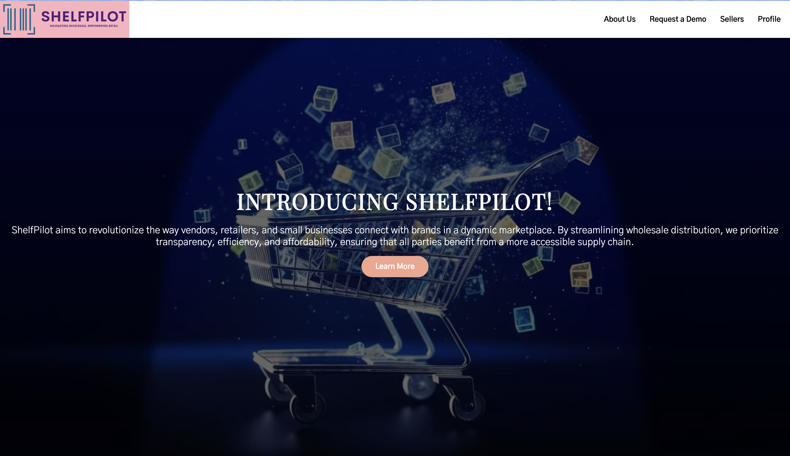
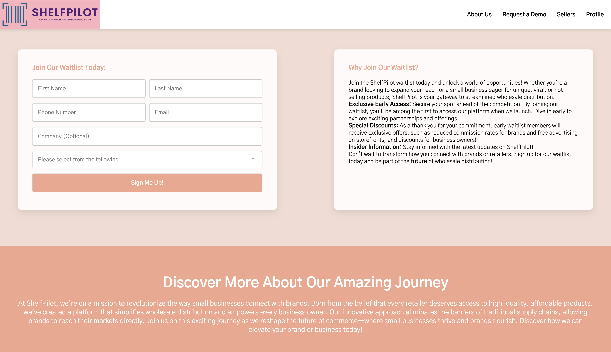
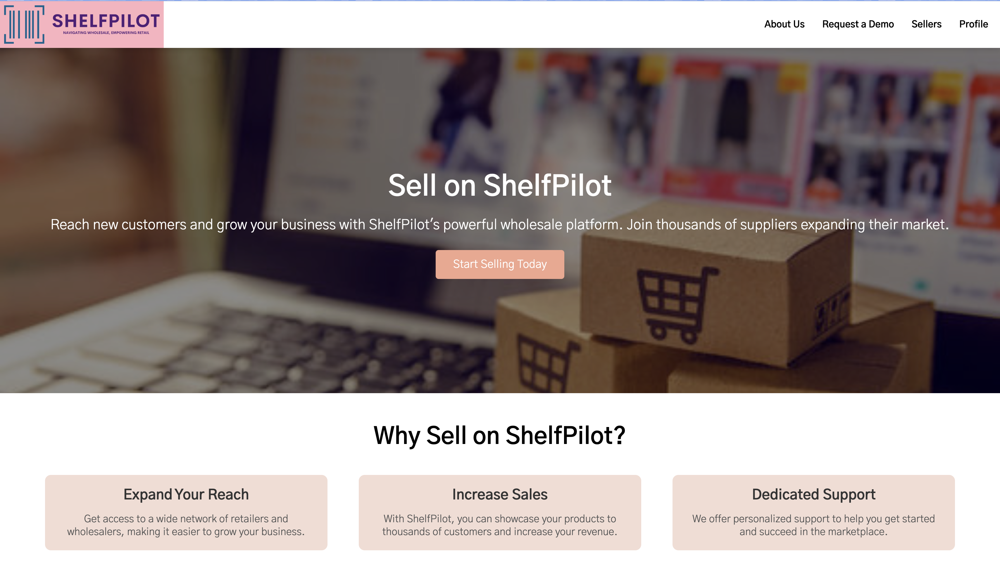
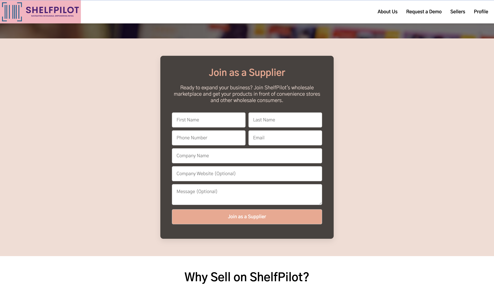
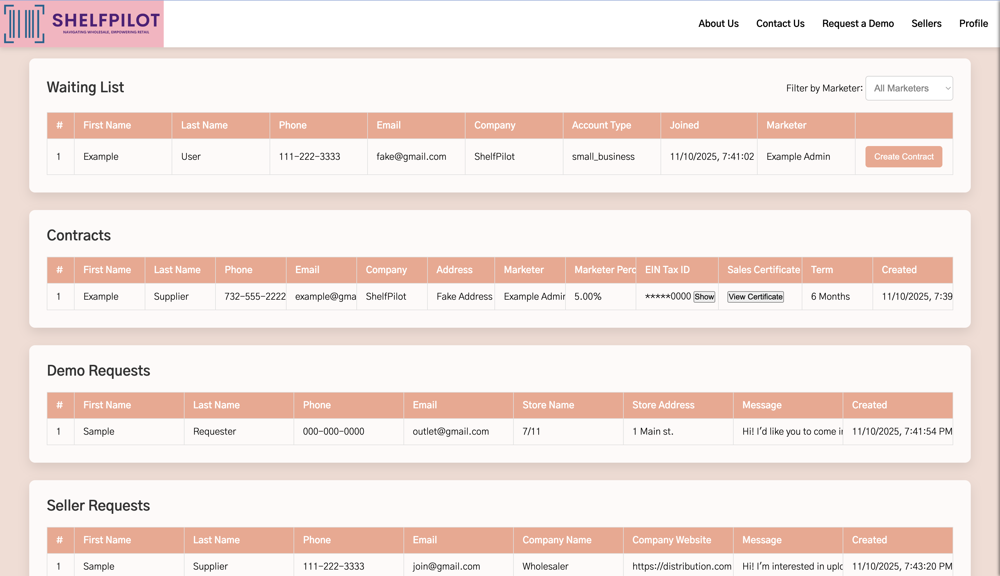
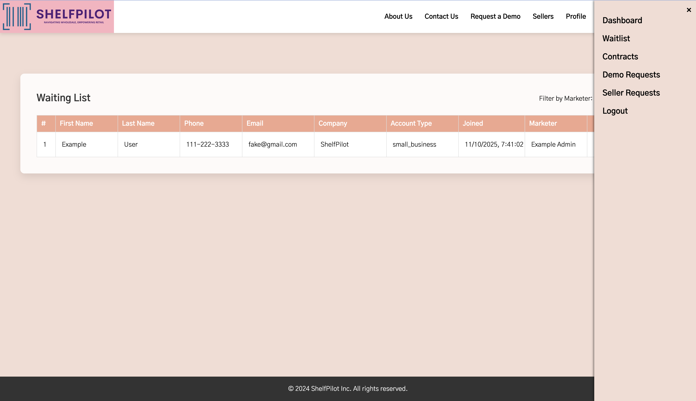
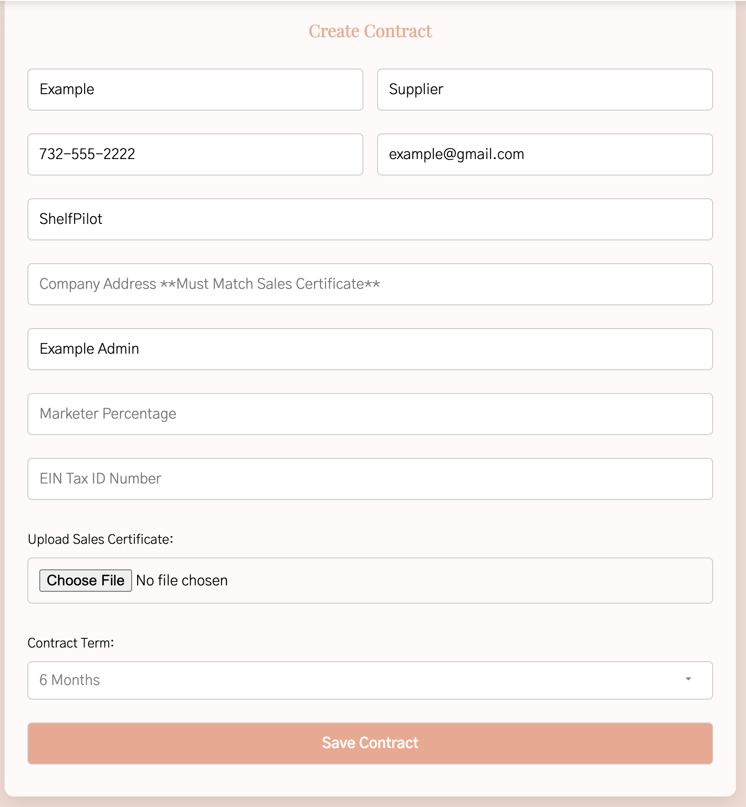

<p align="center">
  <h1>ShelfPilot Marketing & Admin Portal</h1>
  <p><em>Full‑stack Node.js/Express + MySQL app for a marketing website with admin tools. It supports public pages (About, Request a Demo, Sellers), user login with role‑based views, waitlist intake, and an admin workflow to convert waitlist entries into official contracts.</em></p>
</p>

---

## Tech Stack

- **Backend**: Node.js, Express, MySQL (mysql2), Multer, dotenv, bcryptjs, express‑session, cors
- **Frontend**: HTML5, CSS3, modular JS (`scripts/*.js`)
  - Reusable navbar/footer injected by `scripts/template.js`
  - Styling split into shared `styles/main.css` + page‑specific sheets
- **Database**: MySQL with tables `accounts`, `waitlist`, `contracts`, `demo_requests`, `seller_requests`

---

## Security & Data Integrity

- **Passwords**: Stored using **bcrypt**; verified with `bcrypt.compare` during login.
- **Sessions**: `express-session` with secret key from `.env`, 30‑minute inactivity timeout.
- **Sensitive Data**: EINs are encrypted using **AES‑256‑CBC**. Masked display (last 4 digits) with a separate password‑check endpoint for full reveal.
- **Validation**: Server‑side checks for lengths, formats, and input presence. 

---

## Key API Endpoints

- `POST /login` — authenticate, set session
- `POST /logout` — clear session
- `GET  /check-login` — session status (username, account_type)
- `POST /waitlist` — add waitlist entry
- `GET  /api/waitlist` — fetch waitlist (admin)
- `POST /create-contract` — create contract from waitlist + **upload** (`sales_certificate`)
- `GET  /api/contracts` — list contracts (EIN masked)
- `POST /view-full-ein` — password check → reveals full EIN for a single contract
- `POST /submit-demo` — save demo request
- `GET  /api/demo-requests` — list demo requests (admin)
- `POST /submit-supplier` — save seller request
- `GET  /api/seller-requests` — list seller requests (admin)

---

## Project Walkthrough

A visual tour of the **ShelfPilot Marketing & Admin Portal** — from waitlist signup to full contract creation.

---

### Homepage

<p align="center">
  <br>
  <em>Homepage introducing ShelfPilot’s mission , with the Join Waitlist section below.</em>
</p>

<p align="center">
  <br>
</p>

---

### About Page

<p align="center">
  <br>
  <em>About page highlighting ShelfPilot’s background and platform overview.</em>
</p>

---

### Request a Demo

<p align="center">
  <br>
  <em>Retailers can schedule a live demo by submitting their contact and business information.</em>
</p>

---

### Sellers Page

<p align="center">
  <br>
  <em>The Sellers page invites vendors to join the marketplace.</em>
</p>

<p align="center">
  <br>
  <em>Clicking “Start Selling Today” opens this registration form for new vendors.</em>
</p>

---

### Login Page

<p align="center">
  <br>
  <em>Admins and marketers log in securely using bcrypt-hashed credentials.</em>
</p>

---

### Admin Dashboard

<p align="center">
  <br>
  <em>Once logged in, admins can navigate to a dashboard of all waitlist, demo, and supplier entries.</em>
</p>

---

### Viewing Individual Tables

<p align="center">
  <br>
  <em>Admins can view each table individually using the navigation bar on the right, which opens by clicking “Profile” in the top-right corner.</em>
</p>

---

### Creating a Contract

<p align="center">
  <br>
  <em>Clicking “Create Contract” from the waiting list opens a secure form to input EIN and contract details, converting a lead into an official partner.</em>
</p>

---

## Local Setup

1. **Clone & install**
   ```bash
   git clone <repo-url>
   cd "Marketing Website"
   npm install
   ```

2. **Create `.env`**
   ```ini
   SECRET_KEY=use-a-32-character-random-string
   SESSION_SECRET=use-a-long-random-string
   DB_HOST=localhost
   DB_USER=your_mysql_user
   DB_PASSWORD=your_mysql_password
   DB_NAME=shelfpilot
   ```

3. **Create runtime folders**
   ```bash
   mkdir -p Sales_Certificates
   ```

4. **Start MySQL & load schema**
   ```sql
   SOURCE sql/initialize_database.sql;
   ```

5. **Run the app**
   ```bash
   node server.js
   # App on http://localhost:3000
   ```

5. **Demo login**

    To explore the admin features, use the pre-loaded demo account included in the database initialization file.

    **Default Admin Credentials:**

    Username: admin  
    Password: password

    Once logged in, you can view the **Admin Dashboard**, where you can:
    - View all waitlist, demo, and supplier entries. *(The tables start empty, but new entries can be made through the public forms on the website, while logged in or not.)*
    - Convert waitlist entries into contracts using the **Create Contract** form.
    - See how EIN encryption, file uploads, and data validation work in practice.

---

**Author:** Amy Margolina

